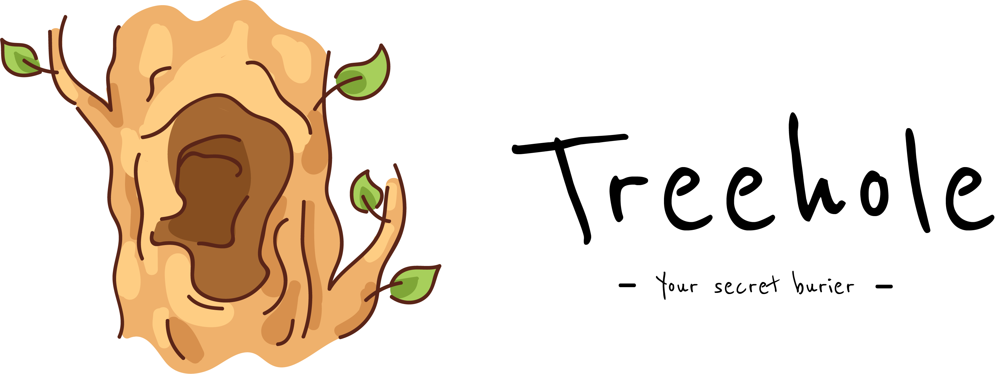

<p align="center"></p>

## Development + Deployment

```bash
# Clone and copy .env file
git clone https://github.com/senhungnet/treehole-server.git
cd treehole-server
cp .env.example .env
```

For development, edit `.env` file

```.env
APP_ENV="development"
ENABLE_PLAYGROUND=true
ENABLE_TRACING=true
```

```bash
# Start server in docker
docker-compose up --build -d
```
